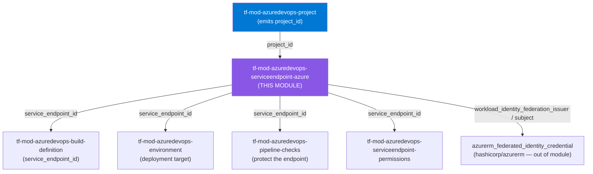
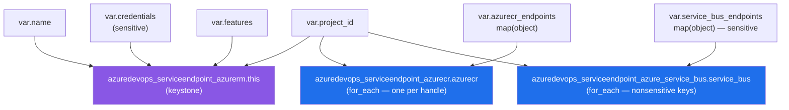

# 🔷 Azure DevOps **Azure Service Connections** Terraform Module

> **Provisions the Azure family of service connections behind one deeply-typed, composable boundary** — `azuredevops_serviceendpoint_azurerm` (ARM) as the keystone, with `azuredevops_serviceendpoint_azurecr` (ACR) and `azuredevops_serviceendpoint_azure_service_bus` as `for_each` child collections, project-wired via `project_id`. Workload-identity-federation first; **write-only secrets are `sensitive` and never emitted.** Built for azuredevops **v1.x**.


---

## 🧩 Overview

This module creates and manages:

- 🔑 **An Azure Resource Manager (ARM) service connection** (`azuredevops_serviceendpoint_azurerm`) — the keystone (`this`) that pipelines reference as `azureSubscription`. Supports **Workload Identity Federation (OIDC)**, **Managed Service Identity**, and **Service Principal** auth schemes, scoped to a subscription or a management group.
- 📦 **Zero or more Azure Container Registry (ACR) service connections** (`azuredevops_serviceendpoint_azurecr`) — each a `for_each` child binding a registry for image push/pull tasks.
- 🚌 **Zero or more Azure Service Bus service connections** (`azuredevops_serviceendpoint_azure_service_bus`) — each a `for_each` child carrying a queue name and a connection string for ServiceBus pipeline tasks.
- 🔗 **Project-scoped wiring** — every endpoint is anchored to a `project_id` sourced from `tf-mod-azuredevops-project`.

> 💡 **Why it matters:** Service connections are how Azure Pipelines authenticate to Azure without scattering credentials through YAML. This module makes the Azure family declarative and consistent, defaults toward **secret-free workload identity federation**, and guarantees that the write-only secrets it does accept (`serviceprincipalkey`, `serviceprincipalcertificate`, `connection_string`) are marked `sensitive` and never surface in plan output, state diffs, or module outputs.

---

## ❤️ Support this project

If these Terraform modules have been helpful to you or your organization, I'd appreciate your support in any of the following ways:

- ⭐ **Star this repository** to help others discover this Terraform module.
- 🤝 **Connect with me on LinkedIn:** [linkedin.com/in/microsoftexpert](https://www.linkedin.com/in/microsoftexpert)
- ☕ **Buy me a coffee:** [buymeacoffee.com/microsoftexpert](https://buymeacoffee.com/microsoftexpert)

Whether it's a star, a professional connection, or a coffee, every gesture helps keep these modules actively maintained and continually improving. Thank you for being part of the community!

---

## 🗺️ Where this fits in the family



---

## 🧬 What this module builds



**Resource inventory**

- 🔑 `azuredevops_serviceendpoint_azurerm.this` — the primary (`this`) keystone resource. Renders optional `credentials`, `features`, and `timeouts` as `dynamic` blocks.
- 📦 `azuredevops_serviceendpoint_azurecr.azurecr` — `for_each` over `var.azurecr_endpoints` (a `map(object(...))` keyed by a caller-supplied stable handle). **No `count`.**
- 🚌 `azuredevops_serviceendpoint_azure_service_bus.service_bus` — `for_each` over the **`nonsensitive` key set** of `var.service_bus_endpoints` (sensitive map); each secret `connection_string` is looked up by key and passed through still-sensitive. **No `count`.**

---

## ✅ Provider / Versions

| Requirement | Version |
|---|---|
| Terraform | `>= 1.12.0` |
| `microsoft/azuredevops` | `>= 1.0, < 2.0` (validated against **v1.15.1**) |

> ℹ️ The module declares the provider **requirement** only — it configures **no** `provider "azuredevops" {}` block. The root module supplies the org URL + PAT or Entra ID service principal.

---

## 🔑 Required Azure DevOps Scopes / Auth

The Terraform identity authenticates via a **PAT** or an **Entra ID service principal / managed identity** (configured at the provider level). It must hold the following before `terraform apply` succeeds.

| Scope / Role | PAT scope | Service-principal role | Required for |
|---|---|---|---|
| **Service Connections** | Service Connections (Read, Query & Manage) | **Administrator** or **Creator** on the `ServiceEndpoints` security namespace, via **Endpoint Administrators** | creating / managing every endpoint in this module (`azurerm`, `azurecr`, `azure_service_bus`) |
| **Endpoint Administrators** | — | Membership in the project **Endpoint Administrators** group | managing endpoint security / sharing |

> ⚠️ **Sharing** a service connection to other projects (cross-project permissions) is an **organization-level administrator** action — it is *not* performed by this module and requires elevated rights. Keep endpoints project-scoped unless a platform owner deliberately shares them.

> ⚠️ This module operates in **manual** mode — you supply the identity (`credentials.serviceprincipalid` for SP/WIF, or rely on an agent MI). It does **not** create Entra app registrations. *Automatic* endpoint creation (no supplied identity) would additionally require **Application Developer** (or app-registration) rights in the Entra tenant — out of scope here by design.

> ℹ️ For **Workload Identity Federation**, the federated credential itself is created **outside** this module (in Entra ID / the `hashicorp/azurerm` provider) using the `workload_identity_federation_issuer` and `workload_identity_federation_subject` outputs. See the end-to-end example.

---

## 📁 Module Structure

```
tf-mod-azuredevops-serviceendpoint-azure/
├── providers.tf # terraform >= 1.12, azuredevops >= 1.0,< 2.0 — no provider{} block
├── variables.tf # name → project_id → azurerm_spn_tenantid → ARM config → child maps → timeouts
├── main.tf # serviceendpoint_azurerm.this +.azurecr (for_each) +.service_bus (for_each)
├── outputs.tf # id, service_endpoint_id, name, project_id, WIF issuer/subject, child id maps
├── SCOPE.md # cross-module contract + required scopes/auth + gotchas
└── README.md # this file
```

---

## ⚙️ Quick Start

```hcl
module "azure_endpoints" {
  source = "git::https://github.com/microsoftexpert/tf-mod-azuredevops-serviceendpoint-azure?ref=v1.0.0"

  name                                   = "casey-prod-arm"
  project_id                             = module.project.project_id # from tf-mod-azuredevops-project
  azurerm_spn_tenantid                   = var.tenant_id
  service_endpoint_authentication_scheme = "WorkloadIdentityFederation" # secret-free — preferred

  azurerm_subscription_id   = var.subscription_id
  azurerm_subscription_name = "Production"
}
```

> ⚠️ Always pin the module with `?ref=v1.0.0` — never a branch. Tags are immutable; branches re-plan the world.

---

## 🔌 Cross-Module Contract

### Consumes

| Input | Type | Source module |
|---|---|---|
| `project_id` | `string` | `tf-mod-azuredevops-project` |
| `azurerm_spn_tenantid` / `azurerm_subscription_id` / … | `string` | Azure subscription facts (often a tfvars or the `azurerm` provider) |
| `credentials.serviceprincipalid` | `string` | An Entra app registration / managed identity client ID |

### Emits

| Output | Description | Consumed by |
|---|---|---|
| `id` | Primary resource ID (`azuredevops_serviceendpoint_azurerm`) | downstream module references |
| `service_endpoint_id` | Resource-specific ID for cross-module wiring | `tf-mod-azuredevops-build-definition`, `tf-mod-azuredevops-environment`, `tf-mod-azuredevops-pipeline-checks`, `tf-mod-azuredevops-serviceendpoint-permissions` |
| `name` | ARM connection name | logging / audit |
| `project_id` | Project ID these endpoints belong to (echoed) | downstream convenience |
| `service_principal_id` | App (client) ID of the ARM SP — **not a secret** | audit, federated-credential wiring |
| `workload_identity_federation_issuer` / `_subject` | OIDC issuer/subject (WIF scheme only) | `azurerm_federated_identity_credential` |
| `azurecr_endpoint_ids` / `azurecr_endpoints` | ACR endpoint IDs (and `{id,name,service_principal_id}`) keyed by handle | build definitions, permissions, audit |
| `service_bus_endpoint_ids` / `service_bus_endpoints` | Service Bus endpoint IDs (and `{id,name}`) keyed by handle | build definitions, permissions, audit |
| `service_endpoint_ids` | All endpoint IDs in one map (`azurerm` + every child handle) | bulk wiring into `serviceendpoint_permissions` |
| _(secrets)_ | **Never emitted** — `serviceprincipalkey`, `serviceprincipalcertificate`, `connection_string` are write-only & `sensitive` | n/a |

---

## 📚 Example Library

<details>
<summary><b>1 · Minimal — Workload Identity Federation (secret-free, preferred)</b></summary>

```hcl
module "azure_endpoints" {
  source = "git::https://github.com/microsoftexpert/tf-mod-azuredevops-serviceendpoint-azure?ref=v1.0.0"

  name                                   = "casey-prod-arm"
  project_id                             = module.project.project_id
  azurerm_spn_tenantid                   = var.tenant_id
  service_endpoint_authentication_scheme = "WorkloadIdentityFederation"
  azurerm_subscription_id                = var.subscription_id
  azurerm_subscription_name              = "Production"
}
```

> ℹ️ No `credentials` block is needed for the *automatic* WIF flow. Supply only `credentials = { serviceprincipalid =... }` for the *manual* WIF flow (an existing app/MI).
</details>

<details>
<summary><b>2 · Service Principal with a client secret (manual)</b></summary>

```hcl
module "azure_endpoints" {
  source = "git::https://github.com/microsoftexpert/tf-mod-azuredevops-serviceendpoint-azure?ref=v1.0.0"

  name                                   = "casey-legacy-arm"
  project_id                             = module.project.project_id
  azurerm_spn_tenantid                   = var.tenant_id
  service_endpoint_authentication_scheme = "ServicePrincipal"
  azurerm_subscription_id                = var.subscription_id
  azurerm_subscription_name              = "Production"

  credentials = {
    serviceprincipalid  = var.sp_client_id
    serviceprincipalkey = var.sp_client_secret # write-only, sensitive
  }
}
```

> ⚠️ A client secret expires and must be rotated. Prefer Workload Identity Federation where the org is enrolled.
</details>

<details>
<summary><b>3 · Service Principal with a certificate</b></summary>

```hcl
credentials = {
  serviceprincipalid          = var.sp_client_id
  serviceprincipalcertificate = file("${path.module}/sp-cert.pem") # write-only, sensitive
}
```
</details>

<details>
<summary><b>4 · Managed Service Identity (agent-assigned, no secret)</b></summary>

```hcl
module "azure_endpoints" {
  source = "git::https://github.com/microsoftexpert/tf-mod-azuredevops-serviceendpoint-azure?ref=v1.0.0"

  name                                   = "casey-mi-arm"
  project_id                             = module.project.project_id
  azurerm_spn_tenantid                   = var.tenant_id
  service_endpoint_authentication_scheme = "ManagedServiceIdentity"
  azurerm_subscription_id                = var.subscription_id
  azurerm_subscription_name              = "Production"
}
```
</details>

<details>
<summary><b>5 · Management-group scope instead of a subscription</b></summary>

```hcl
module "azure_endpoints" {
  source = "git::https://github.com/microsoftexpert/tf-mod-azuredevops-serviceendpoint-azure?ref=v1.0.0"

  name                                   = "casey-mg-arm"
  project_id                             = module.project.project_id
  azurerm_spn_tenantid                   = var.tenant_id
  service_endpoint_authentication_scheme = "WorkloadIdentityFederation"

  azurerm_management_group_id   = "casey-platform-mg"
  azurerm_management_group_name = "Platform"
}
```

> ⚠️ Provide **either** a subscription scope (`azurerm_subscription_id` + `azurerm_subscription_name`) **or** a management-group scope (`azurerm_management_group_id` + `azurerm_management_group_name`) — not both.
</details>

<details>
<summary><b>6 · Validate the connection on apply</b></summary>

```hcl
module "azure_endpoints" {
  source = "git::https://github.com/microsoftexpert/tf-mod-azuredevops-serviceendpoint-azure?ref=v1.0.0"

  name                      = "casey-prod-arm"
  project_id                = module.project.project_id
  azurerm_spn_tenantid      = var.tenant_id
  azurerm_subscription_id   = var.subscription_id
  azurerm_subscription_name = "Production"

  features = {
    validate = true # verify the connection against Azure after create/update
  }
}
```
</details>

<details>
<summary><b>7 · Non-default cloud (US Government)</b></summary>

```hcl
module "azure_endpoints" {
  source = "git::https://github.com/microsoftexpert/tf-mod-azuredevops-serviceendpoint-azure?ref=v1.0.0"

  name                      = "casey-gov-arm"
  project_id                = module.project.project_id
  azurerm_spn_tenantid      = var.tenant_id
  environment               = "AzureUSGovernment" # IMMUTABLE — forces new on change
  azurerm_subscription_id   = var.gov_subscription_id
  azurerm_subscription_name = "Gov"
}
```
</details>

<details>
<summary><b>8 · One Azure Container Registry endpoint</b></summary>

```hcl
module "azure_endpoints" {
  source = "git::https://github.com/microsoftexpert/tf-mod-azuredevops-serviceendpoint-azure?ref=v1.0.0"

  name                      = "casey-prod-arm"
  project_id                = module.project.project_id
  azurerm_spn_tenantid      = var.tenant_id
  azurerm_subscription_id   = var.subscription_id
  azurerm_subscription_name = "Production"

  azurecr_endpoints = {
    caseyacr = {
      resource_group            = "rg-casey-acr"
      azurecr_spn_tenantid      = var.tenant_id
      azurecr_name              = "caseyprodacr"
      azurecr_subscription_id   = var.subscription_id
      azurecr_subscription_name = "Production"
    }
  }
}
```

> ℹ️ The ACR endpoint stores **no secret** — its `credentials` block carries only `serviceprincipalid`. Auth defaults to `ServicePrincipal`; set `WorkloadIdentityFederation` per entry to go secret-free.
</details>

<details>
<summary><b>9 · Multiple ACR endpoints with WIF + per-entry timeouts</b></summary>

```hcl
azurecr_endpoints = {
  prod = {
    resource_group                         = "rg-casey-acr"
    azurecr_spn_tenantid                   = var.tenant_id
    azurecr_name                           = "caseyprodacr"
    azurecr_subscription_id                = var.subscription_id
    azurecr_subscription_name              = "Production"
    service_endpoint_authentication_scheme = "WorkloadIdentityFederation"
    credentials                            = { serviceprincipalid = var.acr_app_id }
    timeouts                               = { create = "5m" }
  }
  shared = {
    resource_group            = "rg-casey-shared"
    azurecr_spn_tenantid      = var.tenant_id
    azurecr_name              = "caseysharedacr"
    azurecr_subscription_id   = var.subscription_id
    azurecr_subscription_name = "Production"
  }
}
```
</details>

<details>
<summary><b>10 · One Azure Service Bus endpoint (sensitive connection string)</b></summary>

```hcl
module "azure_endpoints" {
  source = "git::https://github.com/microsoftexpert/tf-mod-azuredevops-serviceendpoint-azure?ref=v1.0.0"

  name                      = "casey-prod-arm"
  project_id                = module.project.project_id
  azurerm_spn_tenantid      = var.tenant_id
  azurerm_subscription_id   = var.subscription_id
  azurerm_subscription_name = "Production"

  service_bus_endpoints = {
    orders = {
      queue_name        = "orders-in"
      connection_string = var.sb_orders_connection_string # write-only, sensitive
    }
  }
}
```

> ⚠️ The whole `service_bus_endpoints` variable is `sensitive`. `connection_string` cannot be read back from the API — treat as **rotation-only**.
</details>

<details>
<summary><b>11 · Multiple Service Bus queues</b></summary>

```hcl
service_bus_endpoints = {
  orders = {
    queue_name        = "orders-in"
    connection_string = var.sb_orders_cs
  }
  notifications = {
    service_endpoint_name = "casey-notify-bus" # override the default (the map key)
    queue_name            = "notify-out"
    connection_string     = var.sb_notify_cs
    timeouts              = { create = "3m" }
  }
}
```
</details>

<details>
<summary><b>12 · Project-wired (upstream project_id → this module)</b></summary>

```hcl
module "project" {
  source = "git::https://github.com/microsoftexpert/tf-mod-azuredevops-project?ref=v1.0.0"
  name   = "Payments-Platform"
}

module "azure_endpoints" {
  source = "git::https://github.com/microsoftexpert/tf-mod-azuredevops-serviceendpoint-azure?ref=v1.0.0"

  name                      = "payments-prod-arm"
  project_id                = module.project.project_id # the canonical wire-in
  azurerm_spn_tenantid      = var.tenant_id
  azurerm_subscription_id   = var.subscription_id
  azurerm_subscription_name = "Production"
}
```
</details>

<details>
<summary><b>13 · Cross-module wiring (this module → build definition + checks)</b></summary>

```hcl
module "azure_endpoints" {
  source                    = "git::https://github.com/microsoftexpert/tf-mod-azuredevops-serviceendpoint-azure?ref=v1.0.0"
  name                      = "payments-prod-arm"
  project_id                = module.project.project_id
  azurerm_spn_tenantid      = var.tenant_id
  azurerm_subscription_id   = var.subscription_id
  azurerm_subscription_name = "Production"
}

module "pipeline_checks" {
  source               = "git::https://github.com/microsoftexpert/tf-mod-azuredevops-pipeline-checks?ref=v1.0.0"
  project_id           = module.project.project_id
  target_resource_id   = module.azure_endpoints.service_endpoint_id # upstream output → input
  target_resource_type = "endpoint"
  #... approval / branch-control config...
}
```
</details>

<details>
<summary><b>14 · Wiring the WIF issuer/subject into an Entra federated credential</b></summary>

```hcl
module "azure_endpoints" {
  source                                 = "git::https://github.com/microsoftexpert/tf-mod-azuredevops-serviceendpoint-azure?ref=v1.0.0"
  name                                   = "casey-prod-arm"
  project_id                             = module.project.project_id
  azurerm_spn_tenantid                   = var.tenant_id
  service_endpoint_authentication_scheme = "WorkloadIdentityFederation"
  azurerm_subscription_id                = var.subscription_id
  azurerm_subscription_name              = "Production"
  credentials                            = { serviceprincipalid = azurerm_user_assigned_identity.deploy.client_id }
}

# Close the federation loop in Entra (hashicorp/azurerm provider)
resource "azurerm_federated_identity_credential" "deploy" {
  name                = "casey-azdo-federated"
  resource_group_name = azurerm_resource_group.identity.name
  parent_id           = azurerm_user_assigned_identity.deploy.id
  audience            = ["api://AzureADTokenExchange"]
  issuer              = module.azure_endpoints.workload_identity_federation_issuer
  subject             = module.azure_endpoints.workload_identity_federation_subject
}
```

> ℹ️ Order matters: the service connection must exist before the federated credential — the issuer/subject are only known after create.
</details>

<details>
<summary><b>15 · 🏁 End-to-end composition (mandatory finale)</b></summary>

```hcl
# 1) Foundation — the project everything wires into
module "project" {
  source = "git::https://github.com/microsoftexpert/tf-mod-azuredevops-project?ref=v1.0.0"
  name   = "Payments-Platform"
}

# 2) THIS MODULE — the Azure family of service connections
module "azure_endpoints" {
  source                                 = "git::https://github.com/microsoftexpert/tf-mod-azuredevops-serviceendpoint-azure?ref=v1.0.0"
  name                                   = "payments-prod-arm"
  project_id                             = module.project.project_id
  azurerm_spn_tenantid                   = var.tenant_id
  service_endpoint_authentication_scheme = "WorkloadIdentityFederation"
  azurerm_subscription_id                = var.subscription_id
  azurerm_subscription_name              = "Production"

  azurecr_endpoints = {
    prod = {
      resource_group                         = "rg-casey-acr"
      azurecr_spn_tenantid                   = var.tenant_id
      azurecr_name                           = "caseyprodacr"
      azurecr_subscription_id                = var.subscription_id
      azurecr_subscription_name              = "Production"
      service_endpoint_authentication_scheme = "WorkloadIdentityFederation"
    }
  }

  service_bus_endpoints = {
    orders = {
      queue_name        = "orders-in"
      connection_string = var.sb_orders_cs # sensitive
    }
  }
}

# 3) Consumer — a build/pipeline definition that uses the ARM + ACR connections
module "build" {
  source              = "git::https://github.com/microsoftexpert/tf-mod-azuredevops-build-definition?ref=v1.0.0"
  project_id          = module.project.project_id
  name                = "payments-ci"
  service_connections = module.azure_endpoints.service_endpoint_ids # all endpoints in one map
}

output "arm_service_endpoint_id" {
  value = module.azure_endpoints.service_endpoint_id
}
```
</details>

---

## 📥 Inputs

<details>
<summary><b>Full input schema</b></summary>

| Name | Type | Default | Required | Sensitive | Description |
|---|---|---|:--:|:--:|---|
| `name` | `string` | — | ✅ | — | ARM connection name (the keystone `service_endpoint_name`). |
| `project_id` | `string` | — | ✅ | — | Project ID. **IMMUTABLE** — wire from `tf-mod-azuredevops-project`. |
| `azurerm_spn_tenantid` | `string` | — | ✅ | — | Entra tenant ID of the identity backing the ARM connection. |
| `service_endpoint_authentication_scheme` | `string` | `"ServicePrincipal"` | — | — | `ServicePrincipal` \| `WorkloadIdentityFederation` \| `ManagedServiceIdentity`. |
| `description` | `string` | `"Managed by Terraform"` | — | — | ARM connection description. |
| `azurerm_subscription_id` / `azurerm_subscription_name` | `string` | `null` | — | — | Subscription scope (set both together). |
| `azurerm_management_group_id` / `azurerm_management_group_name` | `string` | `null` | — | — | Management-group scope (set both together, instead of subscription). |
| `environment` | `string` | `"AzureCloud"` | — | — | Cloud environment. **IMMUTABLE**. Enum-validated. |
| `server_url` | `string` | `null` | — | — | Server URL (AzureStack etc.). **IMMUTABLE**. |
| `resource_group` | `string` | `null` | — | — | RG scope for an automatic ARM connection. |
| `credentials` | `object({...})` | `null` | — | ✅ | SP credentials (`serviceprincipalid`, optional `serviceprincipalkey`/`serviceprincipalcertificate`). |
| `features` | `object({ validate })` | `null` | — | — | `validate = optional(bool, false)` — verify connection on create/update. |
| `azurecr_endpoints` | `map(object({...}))` | `{}` | — | — | ACR endpoints keyed by handle. |
| `service_bus_endpoints` | `map(object({...}))` | `{}` | — | ✅ | Service Bus endpoints keyed by handle (carries `connection_string`). |
| `timeouts` | `object({ create, read, update, delete })` | `{}` | — | — | Operation timeouts for the ARM keystone. |

**`credentials` object schema** (the whole variable is `sensitive`)

```hcl
object({
 serviceprincipalid = string # SP application (client) ID — required when set
 serviceprincipalkey = optional(string) # SP client secret — WRITE-ONLY, sensitive
 serviceprincipalcertificate = optional(string) # SP certificate (PEM) — WRITE-ONLY, sensitive
})
```

**`azurecr_endpoints` object schema**

```hcl
map(object({
 service_endpoint_name = optional(string) # defaults to the map key
 resource_group = string # required
 azurecr_spn_tenantid = string # required
 azurecr_name = string # required
 azurecr_subscription_id = string # required
 azurecr_subscription_name = string # required
 service_endpoint_authentication_scheme = optional(string, "ServicePrincipal") # or WorkloadIdentityFederation
 description = optional(string, "Managed by Terraform")
 credentials = optional(object({
 serviceprincipalid = string # NO secret stored for ACR
 }))
 timeouts = optional(object({ create, read, update, delete }), {})
}))
```

**`service_bus_endpoints` object schema** (the whole variable is `sensitive`)

```hcl
map(object({
 service_endpoint_name = optional(string) # defaults to the map key
 queue_name = string # required
 connection_string = string # required — WRITE-ONLY, sensitive
 description = optional(string, "Managed by Terraform")
 timeouts = optional(object({ create, read, update, delete }), {})
}))
```
</details>

---

## 🧾 Outputs

| Output | Sensitive | Description |
|---|:--:|---|
| `id` | — | ARM service connection ID (primary output). |
| `service_endpoint_id` | — | ARM service connection ID for cross-module wiring. |
| `name` | — | ARM connection name. |
| `project_id` | — | Project ID these endpoints belong to (echoed). |
| `service_principal_id` | — | App (client) ID of the ARM SP — **not a secret**. |
| `workload_identity_federation_issuer` | — | OIDC issuer (WIF scheme only; else empty). |
| `workload_identity_federation_subject` | — | OIDC subject (WIF scheme only; else empty). |
| `azurecr_endpoint_ids` | — | Map of ACR endpoint IDs keyed by handle. |
| `azurecr_endpoints` | — | Map of `{ id, name, service_principal_id }` per ACR endpoint. |
| `service_bus_endpoint_ids` | — | Map of Service Bus endpoint IDs keyed by handle. |
| `service_bus_endpoints` | — | Map of `{ id, name }` per Service Bus endpoint. |
| `service_endpoint_ids` | — | All endpoint IDs in one map (`azurerm` + every child handle). |

> ⚠️ **No secret is ever emitted.** `serviceprincipalkey`, `serviceprincipalcertificate`, and `connection_string` are write-only and deliberately absent from every output. `service_principal_id` and the WIF issuer/subject are public identifiers, not secrets.

---

## 🧠 Architecture Notes

- **Project-scoped, not org-scoped.** All three resources are anchored to `project_id`. A service connection lives inside one project; *sharing* it to other projects is a separate org-admin action this module does not perform.
- **Write-only secrets.** The provider cannot read `serviceprincipalkey`, `serviceprincipalcertificate`, or `connection_string` back after create. Treat them as **rotation-only**: a change to the value updates the endpoint, but Terraform can never detect drift in the stored secret. The containing variables are `sensitive`.
- **Workload Identity Federation first.** WIF (OIDC) stores **no secret**, never expires, and can't be exfiltrated by a task — Microsoft's recommended scheme. Prefer it; fall back to `ManagedServiceIdentity`, then `ServicePrincipal` only where required. The federated credential is created out-of-band using the issuer/subject outputs.
- **ACR carries no secret.** `azuredevops_serviceendpoint_azurecr` exposes only `serviceprincipalid` in its `credentials` block — there is no key field. `ManagedServiceIdentity` is **not yet implemented** by the provider for ACR (the typed schema restricts the enum to `ServicePrincipal` / `WorkloadIdentityFederation`).
- **Sensitive `for_each`.** `var.service_bus_endpoints` is sensitive, and Terraform forbids a sensitive value as a `for_each` argument. The module iterates `nonsensitive(toset(keys(...)))` (handles are caller-supplied, not secret) and looks up each value by key — `connection_string` is passed through **still-sensitive**, while non-secret fields (name, queue, timeouts) are unwrapped so plans stay readable.
- **Immutable fields.** `project_id`, `environment`, and `server_url` force destroy/recreate on change.
- **Scope is exclusive.** Provide either a subscription scope **or** a management-group scope on the ARM endpoint — the provider rejects neither-or-both at apply.
- **Eventual consistency.** Azure DevOps is distributed; a freshly created endpoint can take a moment to be readable. A re-`plan`/`apply` resolves transient `404`/not-found races.
- **Pipeline authorization is separate.** Allowing a pipeline to *use* an endpoint (`azuredevops_pipeline_authorization`) and protecting it with approvals/checks (`tf-mod-azuredevops-pipeline-checks`) are deliberately out of scope — wire `service_endpoint_id` into those modules.
- **No process-customization prerequisites, no tags.** This family has none of either.

---

## 🧱 Design Principles

- **One keystone `this`, children by role.** `azuredevops_serviceendpoint_azurerm.this` is the primary; ACR and Service Bus are `for_each` over `map(object(...))` keyed by a caller-supplied handle — **never `count`**.
- **Make the type the contract.** Deeply-typed `object` schemas, `optional` with safe defaults, and `validation {}` blocks (auth scheme, cloud environment, required child fields) reject malformed input at plan time.
- **`main.tf` is a total renderer.** `dynamic` blocks for every optional block (`credentials`, `features`, `timeouts`); `try(x, null)` on every optional nested field.
- **Secret-safe by construction.** Every secret variable is `sensitive`; `nonsensitive` is used surgically only on non-secret keys/fields; **no secret is ever output**.
- **Secure defaults.** Auth scheme documented and exampled toward Workload Identity Federation; `features.validate` opt-in.
- **Primary output is `id`**, with the resource-specific `service_endpoint_id` additionally emitted for clean downstream wiring.

---

## 🚀 Runbook

```powershell
cd C:\GitHubCode\newazuredevopsmodules\tf-mod-azuredevops-serviceendpoint-azure
terraform init -backend=false
terraform validate
terraform fmt -check
```

> ⚠️ `terraform plan` / `apply` require live organization credentials (org URL + PAT, or an Entra ID service principal). The offline gate above is sufficient for structural correctness. For live testing, use a **non-production** organization with a dedicated identity that holds the required scopes. **Never test against the production org.**

---

## 🧪 Testing

- ✅ `terraform init -backend=false` — provider resolves to `microsoft/azuredevops v1.15.1`.
- ✅ `terraform validate` — **Success! The configuration is valid.**
- ✅ `terraform fmt -check` — no formatting differences.
- ✅ Two-case `plan` harness (full ServicePrincipal + ACR + Service Bus, and WIF with empty child maps) — passes variable validation and `for_each` graph construction (including the sensitive-map `nonsensitive` paths); only the dummy-org authentication fails, confirming the secret handling is sound.
- 🔁 Live integration (optional, non-prod org): apply, then confirm the connection exists in **Project settings → Service connections** — integration-test aid only, requires Security / Cloud Platform sign-off.

---

## 💬 Example Output

```text
Apply complete! Resources: 3 added, 0 changed, 0 destroyed.

Outputs:

id = "11111111-1111-1111-1111-111111111111"
service_endpoint_id = "11111111-1111-1111-1111-111111111111"
name = "payments-prod-arm"
project_id = "00000000-0000-0000-0000-000000000000"
service_principal_id = "22222222-2222-2222-2222-222222222222"
workload_identity_federation_issuer = "https://vstoken.dev.azure.com/00000000-0000-0000-0000-000000000000"
workload_identity_federation_subject = "sc://FinancialPartners/Payments-Platform/payments-prod-arm"
azurecr_endpoint_ids = {
 "prod" = "33333333-3333-3333-3333-333333333333"
}
service_bus_endpoint_ids = {
 "orders" = "44444444-4444-4444-4444-444444444444"
}
```

---

## 🔍 Troubleshooting

| Symptom | Likely cause | Fix |
|---|---|---|
| `403` / not authorized on endpoint create | Identity lacks **Endpoint Administrators** / **Service Connections (Read, Query & Manage)** | Grant the PAT scope or add the SP to Endpoint Administrators (see 🔑 section). |
| `401 Unauthorized` at first call | PAT expired or wrong org URL | Re-issue the PAT with the correct scope; verify `org_service_url`. |
| `Failed to obtain the JWT using service principal client ID` | Secret just rotated, or misconfigured app | Wait a few minutes for Entra to propagate the secret; verify the SP secret/cert. |
| `AADSTS7000222: provided client secret keys are expired` | `serviceprincipalkey` expired | Rotate the secret (write-only — supply a new value) or convert to Workload Identity Federation. |
| Plan wants to recreate the endpoint | `project_id`, `environment`, or `server_url` changed | These are immutable — recreate is expected; change deliberately. |
| `Sensitive value in for_each` (if you fork the module) | Iterating the sensitive `service_bus_endpoints` directly | Iterate `nonsensitive(toset(keys(...)))` and look up values by key (as this module does). |
| WIF federated credential fails to bind | Created before the service connection, or wrong issuer/subject | Create the connection first; wire `workload_identity_federation_issuer`/`_subject` into the Entra credential. |
| `One of Subscription or ManagementGroup … must be specified` | Neither (or both) scopes set | Set exactly one scope pair on the ARM endpoint. |
| Org-vs-project mismatch | `project_id` points at the wrong project | The endpoint and its consumers must live in the **same** project. |
| Transient `404` immediately after create | Eventual consistency | Re-run `terraform plan` / `apply`. |
| Pipeline can't use the connection | Pipeline not authorized for the endpoint | Authorize the pipeline (`azuredevops_pipeline_authorization`) or grant access in the endpoint's Security. |

---

## 🔗 Related Docs

- 📘 [`azuredevops_serviceendpoint_azurerm`](https://registry.terraform.io/providers/microsoft/azuredevops/latest/docs/resources/serviceendpoint_azurerm)
- 📘 [`azuredevops_serviceendpoint_azurecr`](https://registry.terraform.io/providers/microsoft/azuredevops/latest/docs/resources/serviceendpoint_azurecr)
- 📘 [`azuredevops_serviceendpoint_azure_service_bus`](https://registry.terraform.io/providers/microsoft/azuredevops/latest/docs/resources/serviceendpoint_azure_service_bus)
- 📗 [Connect to Azure with an ARM service connection](https://learn.microsoft.com/azure/devops/pipelines/library/connect-to-azure)
- 📗 [Workload identity federation for Azure service connections](https://learn.microsoft.com/azure/devops/pipelines/release/configure-workload-identity)
- 📗 [Service connection security & permissions](https://learn.microsoft.com/azure/devops/pipelines/policies/permissions#set-service-connection-security-in-azure-pipelines)
- 📗 [Make your Azure DevOps secure — scope service connections](https://learn.microsoft.com/azure/devops/organizations/security/security-overview#scope-service-connections)
- 📗 [Troubleshoot ARM service connections](https://learn.microsoft.com/azure/devops/pipelines/release/azure-rm-endpoint)
- 🧩 Sibling modules: `tf-mod-azuredevops-project`, `tf-mod-azuredevops-build-definition`, `tf-mod-azuredevops-environment`, `tf-mod-azuredevops-pipeline-checks`, `tf-mod-azuredevops-serviceendpoint-permissions`, and the other `serviceendpoint_*` families.

---

> 💙 *"Infrastructure as Code should be standardized, consistent, and secure."*
